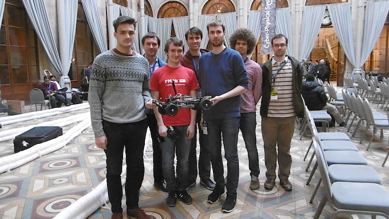

# F1/10 @ CTU
Workspace containing whatever is needed to run F1/10 car at CTU. We use V2 car configuration with the VESC and Teensy.

**Headstart**: This file is written in a way to be more generic. It means that distro versions may be omitted and only common designation is kept - (e.g. for package `ros-indigo-std-msgs` only `-std-msgs` is left)

## ROS over network
For communication over network, following environment variables needs to be
exported on remote:
```
export ROS_MASTER_URI=http://IP_ADDR_OF_TEGRA:11311
export ROS_IP=LOCAL_IP_ADDR
```

and the following on the Tegra:
```
export ROS_IP=LOCAL_IP_ADDR
```

## Installing / Getting started

### Compile the project
The main ROS package (rericha\_racing) can be compiled using the catkin tool

```
cd catkin_ws
catkin_make
source devel/setup.bash
```

### Message packages
Installing ROS full already includes almost all used messages. However some of them are missing:

### Teensy firmware
The firmware is used for accomplishing the following tasks:
- Generate PWM signals for controlling the steering servo and setting the reference speed for the VESC
- Capture the output of the RF transceiver
- Based on signal values coming from the RF transceiver, switch from autonomous to manual control mode
- Switching between manual and autonomous mode is possible by sending boolean value on the eStop topic

Note that in order for the firmware to be compatible with the power board supplied to the participants,
one needs to solder a wire between pins 2 and 4 of the Teensy board.

#### In schroot
- catkin workspace already sourced
- clone the teensy-template submodule with the required toolchain

```
git submodule update --init
```

```
sudo apt-get install ros-indigo-rosserial-arduino ros-indigo-rosserial
rm -rf ./hw/teensy-template/libraries/ros_lib/
rosrun rosserial_arduino make_libraries.py ./hw/teensy-template/libraries/
```
- install rosserial packages
- if present, delete ros libraries first
- create ros libraries for teensy

#### In host system
```
cd ./hw/teensy-template/
git am ../teensy-drive/teensy-template.patch
make
make upload
```

- change to teensy directory
- patch teensy template (only once, after submodule init)
- build the teensy firmware
- upload to teensy board

### Run the competition code
```
roslaunch rericha_racing run_follow-the-gap.launch
```

## Licensing
This project is published under GPLv3.

## File tree
    f1tenth                         # this repository
    ├── catkin_ws                   # catkin workspace
    │   └── src                         # sources of ROS packages
    │       └── rericha_racing              # external, for simulations
    ├── hw                          # hardware, low level, firmware
    └── README.md                   # this readme file

## About Us


Hi, we are a bunch of enthusiastic students and engineers from Prague.

Our team has 7 members:
- 4 Master students (A. Pedersen, D. Kopecky, J. Bednar, J. Klapalek),
- 2 Ph.D. students (J. Matejka, M. Vajnar)
- 1 professor (Z. Hanzalek)


web pages: http://industrialinformatics.cz
e-mail: rericha@rtime.felk.cvut.cz
